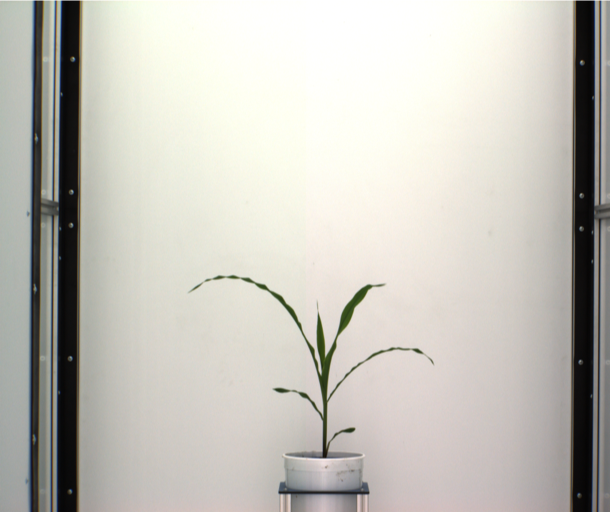
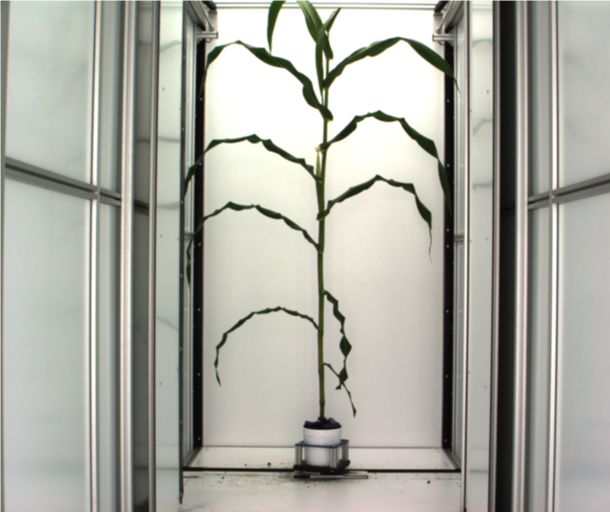
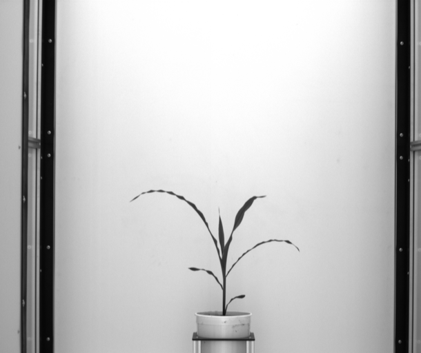
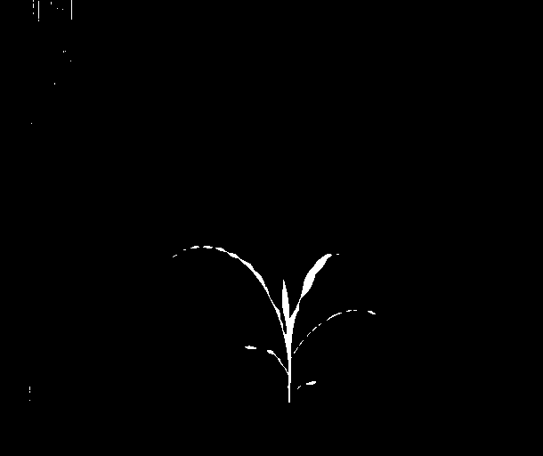
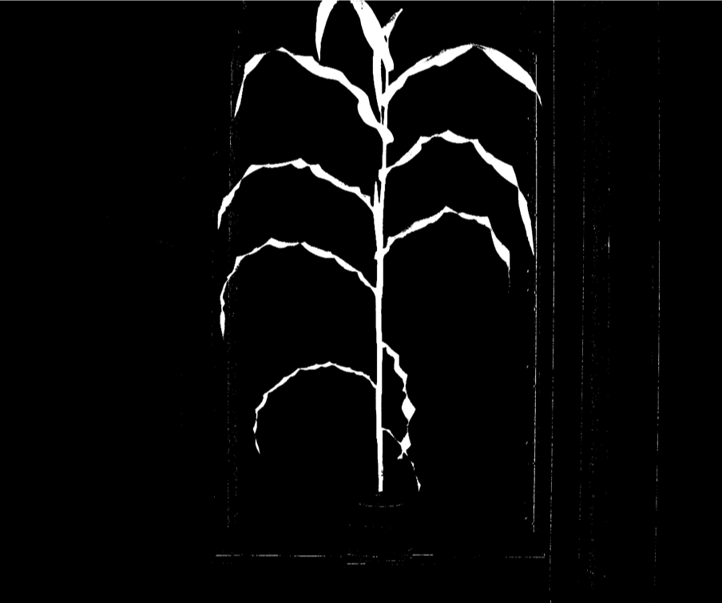
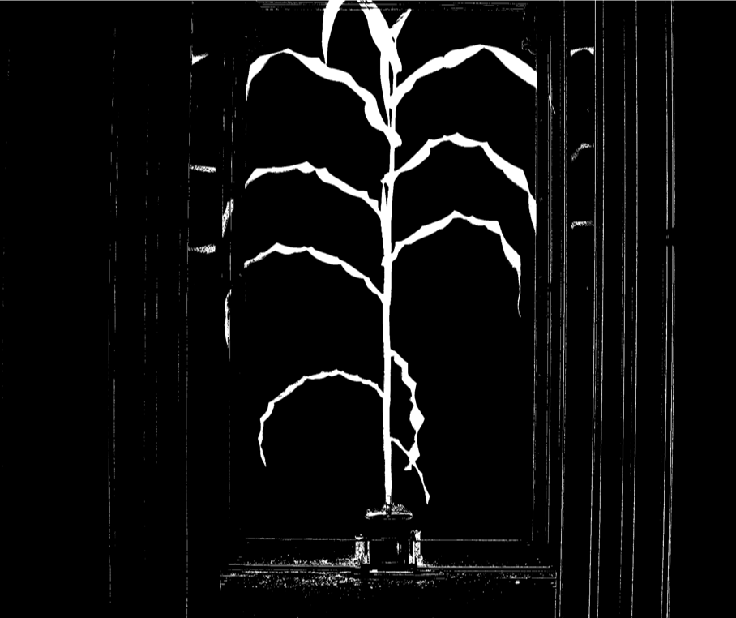

```{r setup, include=FALSE, message=FALSE, warning = FALSE}
knitr::opts_chunk$set(echo = TRUE)
library(tidyverse)
```

# Image Processing with R

## Plant image processing

Feature extraction: 

- plant size, height … … 
- convex hull, skeleton … …

 \ \ \ \ \ 


## The `png` package

- Read images into R

```{r warning = FALSE, message = FALSE}
library(png)

image1=readPNG("images/plant1.png")
image2=readPNG("images/plant2.png")
```

`image1` and `image2` are a 3-dimensional array

## Size of the image

```{r warning = FALSE, message = FALSE}
dim(image1)
dim(image2)
```

- `512` is the number of rows in the image
- `610` is the number of columns in the image
- `4` includes the red, green and blue channels of the iamge; the last channel is the transparency
- each R, G, B intensity give a `512 * 610` matrix
- each element in the matrix is a pixel

## Channels

```{r warning = FALSE, message = FALSE}
image1R = image1[, , 1] # Red intensity
image1G = image1[, , 2] # Green intensity
image1B = image1[, , 3] # Blue intensity
```

Usually don't use the 4th channel.

## Color intensity

```{r, echo = FALSE}
v1 = as.vector(image1R)
n1 = rep("red", length(v1))
v2 = as.vector(image1G)
n2 = rep("green", length(v2))
v3 = as.vector(image1B)
n3 = rep("blue", length(v3))
v = c(v1, v2, v3)
n = c(n1, n2, n3)
data = data.frame(channel = n, intensity = v)
```

```{r warning = FALSE, message = FALSE}
library(tidyverse)

data %>% ggplot(aes(intensity)) + geom_histogram() + facet_wrap(~ channel)
```

## Resolution


```{r warning = FALSE, message = FALSE}
image3=readPNG("images/plant3.png")
dim(image3)
```

## Transformation on the channels

RGB to Gray image transformation

```{r}
## Function: RGB Convert to Gray
Color2Gray = function(image, weight = c(0.299, 0.587, 0.114)){
#weight should be positive
	weight = weight / sum(weight)
	imageGray = image[, , 1] * weight[1] + image[, , 2] * weight[2] + image[, , 3] * weight[3]
  return(imageGray)
}
imageGray = Color2Gray(image1)
writePNG(imageGray, "imageGray.png")
```



## Green intensity contrast

- `weight = c(0.299, 0.587, 0.114)` is the weight on the `R`, `G`, `B` channels
- Consider `weight = c(-1, 2, -1)` for green intensity contrast
- May result in negative intensity value, not a valid image
- Black and White image (0-1 image)

## Plant segmentation

```{r}
imageBinary = function(image, weight = c(-1, 2, -1), threshold1 = 30 / 255, threshold2 = 0.075){
	weight = weight / sqrt(sum(weight^2))
	imagesum = image[, , 1] + image[, , 2] + image[, , 3]
	temp1 = 1 * (imagesum > threshold1)
	imageweight = image[, , 1] * weight[1] + image[, , 2] * weight[2] + image[, , 3] * weight[3] 
	temp2 = 1 * (imageweight > threshold2 * imagesum)
	return(temp1 * temp2)
}
imageBW = imageBinary(image1,  weight = c(-1, 2, -1), threshold1 = 30 / 255, threshold2 = 0.05)
writePNG(imageBW,"imageBW.png")
```



## Plant trait (Question needs be solved)

- plant size: total white pixel counts from the lack-white image
- plant height: the number of the top row with white pixel minus that of the bottom row with white pixel
- plant height is very sensitive to the segmentation noise

```{r}
plantsize = sum(imageBW)
RowCount = rowSums(imageBW); ColCount = colSums(imageBW)
NonzeroRow = which(RowCount > 0); NonzeroCol = which(ColCount > 0)
plantheight = quantile(NonzeroRow, 0.975)[[1]] - quantile(NonzeroRow, 0.025)[[1]]
plantwidth = quantile(NonzeroCol, 0.975)[[1]] - quantile(NonzeroCol, 0.025)[[1]]
```

## Getting worse as plant grows

 \ \ \ \ \ 

